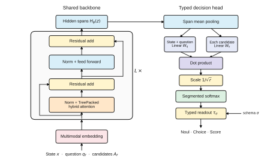

# MoJev

[](https://molemo-lab.github.io/mojev/)
[](https://huggingface.co/spaces/di-zhang-fdu/mojev)
[](paper/mojev-preprint.pdf)
[](https://huggingface.co/MoLeMo-Lab/mojev)
[](https://huggingface.co/datasets/MoLeMo-Lab/mojev-mix)
[](https://github.com/MoLeMo-Lab/mojev/actions/workflows/ci.yml)
[](LICENSE)

**Typed, calibrated decisions in one forward pass.**

Contact: [contact@molemo.org](mailto:contact@molemo.org)

MoJev takes text or image state and a runtime-defined schema, then returns a
probability distribution over the permitted values. It runs locally and is
wire-compatible with the TypeSafe Python SDK's `system_one` API.

| MoJev family resource | purpose |
|---|---|
| [`MoLeMo-Lab/mojev`](https://huggingface.co/MoLeMo-Lab/mojev) | 0.85B trained checkpoint |
| [`MoLeMo-Lab/mojev-mix`](https://huggingface.co/datasets/MoLeMo-Lab/mojev-mix) | training and evaluation mixture |
| [Results](#results) | metrics, controls, and serving benchmarks |
| [`ROADMAP.md`](ROADMAP.md) | next experiments and releases |
| [Preprint (PDF)](paper/mojev-preprint.pdf) | manuscript |
| [Project page](https://molemo-lab.github.io/mojev/) | method and results overview |

## Quickstart

**[Try MoJev on Hugging Face Spaces](https://huggingface.co/spaces/di-zhang-fdu/mojev)** —
text, images and custom candidates, scored on server-side ZeroGPU. No model
download is needed in the browser. Upload one or multiple images alongside your
context. [Space source](space/) · [Optional local browser runtime](browser/).

```sh
git clone https://github.com/MoLeMo-Lab/mojev
cd mojev
pip install -e '.[transformers]'

mojev serve MoLeMo-Lab/mojev --port 8000
```

Use the official TypeSafe client against the local endpoint:

```python
from typesafe_sdk import Choice, TypeSafeClient

with TypeSafeClient(api_key="local", base_url="http://127.0.0.1:8000") as client:
    result = client.system_one(
        state={"document": "I was charged twice. Please fix this ASAP."},
        questions={
            "category": Choice(
                instructions="What is this ticket about?",
                criteria={"billing": None, "technical": None, "other": None},
            )
        },
    )

print(result.choices["category"].choice)        # billing
print(result.choices["category"].probabilities) # full distribution
```

`Choice`, `Noul`, and `Score` questions can share one request. The server packs
them into one model invocation.

MoJev supports a 262,144-token native context and up to 1,010,000 tokens with
YaRN scaling. Training truncates state inputs at 16,384 tokens; inference uses
that window by default. Serving at 1M uses a YaRN configuration. The `serve`,
`eval metrics`, and `eval consistency` commands accept `--context-tokens` to
select a larger inference state window.

```sh
mojev serve MoLeMo-Lab/mojev --port 8000 --context-tokens 16384
```

The drone-control analysis uses the 16K window:

```sh
python -m examples.causal MoLeMo-Lab/mojev \
  --data data/mix/test.jsonl --context-tokens 16384
```

## Contract

- **Runtime schemas.** Candidate values are supplied with the request and read
  directly from their text.
- **Typed output.** The decoder returns values permitted by the schema together
  with their probabilities.
- **Parallel questions.** State is shared, while every question and candidate
  branch remains isolated by the attention mask.
- **Measured confidence.** Releases report calibration beside accuracy.

## Architecture



Each candidate attends to the state, its own question, and its own tokens. A
rank-512 readout converts the encoded context/candidate pair into one logit. The
training objective combines Plackett–Luce ranking and Brier calibration loss.

## Multimodal state

The released model includes its image processor:

```sh
pip install -e '.[transformers]'
mojev serve MoLeMo-Lab/mojev --port 8000
```

An image is referenced inside the state by its absolute path:

```python
from pathlib import Path
from typesafe_sdk import Choice, TypeSafeClient

image = Path("examples/cat.jpg").resolve()
state = (
    "Identify the main subject. "
    f"<|vision_start|><|image_pad|><|vision_end|>{image}"
)

with TypeSafeClient(api_key="local", base_url="http://127.0.0.1:8000") as client:
    result = client.system_one(
        state=state,
        questions={
            "subject": Choice(
                instructions="Which subject is shown?",
                criteria={"cat": None, "dog": None, "car": None, "other": None},
            )
        },
    )

print(result.choices["subject"].probabilities)
```

The processor loads the image, expands it into visual patch tokens, and places
those tokens inside the shared state branch of the tree mask. Multiple image
markers can appear in one state.

Visual response smoke test with the released checkpoint:

| candidate set | grey image P(cat) | cat image P(cat) |
|---|---:|---:|
| `cat`, `dog` | 0.471 | **0.786** |
| `cat`, `dog`, `car`, `other` | 0.264 | **0.528** |

## Results

On 12,000 evaluation decisions, the released checkpoint reaches **93.23%**
accuracy with **0.79%** expected calibration error.

## Reproduce

```sh
hf download MoLeMo-Lab/mojev-mix --repo-type dataset --local-dir data/mix

mojev eval metrics MoLeMo-Lab/mojev \
  data/mix/test.jsonl data/mix/ood.jsonl --limit 12000
mojev eval consistency MoLeMo-Lab/mojev data/mix/test.jsonl --rows 128
mojev tests api MoLeMo-Lab/mojev data/mix/test.jsonl --rows 300 \
  --concurrency 4 --sdk /path/to/typesafe-sdk-python/src
```

The consistency suite checks candidate-order invariance, state padding, and
distractor swaps. The API test compares served probabilities with in-process
probabilities for the same rows.

## Train

```sh
torchrun --nproc_per_node=8 -m mojev.full \
  data/mix/train.jsonl --validation data/mix/validation.jsonl \
  --schema data/mix/schema.json --hf-model "$MODEL" --output runs/mix-pl/ \
  --epochs 1 --batch-size 4 --accumulate 6 --context-tokens 16384 \
  --learning-rate 1e-5 --brier-weight 1.0
```

The published run used one epoch, eight-way data parallel, and completed in 47
minutes. Dataset construction commands are documented in the
[dataset card](https://huggingface.co/datasets/MoLeMo-Lab/mojev-mix).

## Repository

| path | contents |
|---|---|
| `mojev/modeling.py` | packed scorer and checkpoint integration |
| `mojev/schema.py` | typed field definitions and decoding |
| `mojev/serve.py` | SDK-compatible HTTP server |
| `mojev/evaluate.py` | accuracy and calibration evaluation |
| `mojev/consistency.py` | structural invariance tests |
| `mojev/openjev.py`, `mojev/balance.py` | dataset construction |
| `tests/` | fast structural and API tests |

Contribution format: an observable contract plus its verification command. See
[CONTRIBUTING.md](CONTRIBUTING.md). Releases are recorded in
[CHANGELOG.md](CHANGELOG.md). Research use can cite [`CITATION.cff`](CITATION.cff).

MIT licensed.
